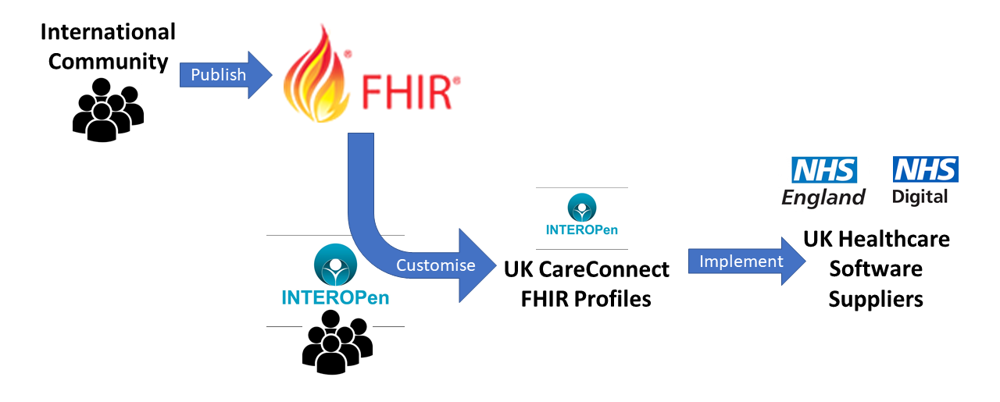
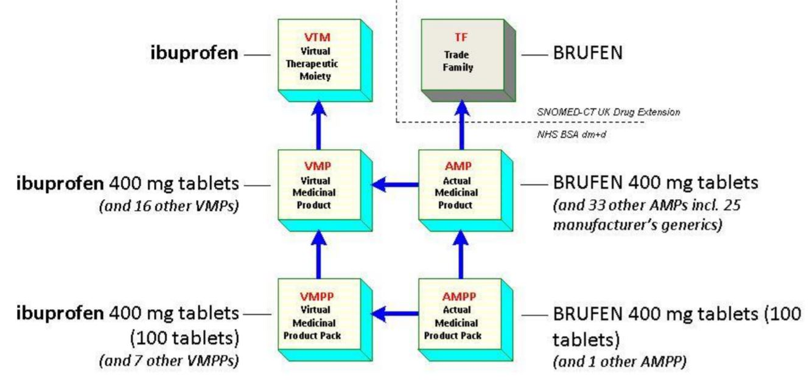



## Introduction ##

This implementation guidance covers the use of dosage structure definitions within HL7 UK INTEROPen CareConnect medication profiles. 

The primary use case is for:

- [CareConnect-MedicationRequest-1](https://fhir.hl7.org.uk/STU3/StructureDefinition/CareConnect-MedicationRequest-1)
- [CareConnect-MedicationDispense-1](https://fhir.hl7.org.uk/STU3/StructureDefinition/CareConnect-MedicationDispense-1)
- [CareConnect-MedicationStatement-1](https://fhir.hl7.org.uk/STU3/StructureDefinition/CareConnect-MedicationStatement-1)

profiled resources as they contain the same [Dosage](http://hl7.org/fhir/stu3/dosage.html#Dosage) structure.

- [CareConnect-MedicationAdministration-1](https://fhir.hl7.org.uk/STU3/StructureDefinition/CareConnect-MedicationAdministration-1) uses a subset of the Dosage structure to describe dose administered.

## How to use this Guidance ##

This guidance will explain the purpose and use of each component of the FHIR Dosage structure through real-world examples. Simple examples will cover the most commonly used part of the dosage structure. More complex examples will demonstrate all other parts of the dosage structure.

Medicine will be described in a state that is appropriate for dispensing and/or administration. Information for a product that requires manipulation before administration (such as reconstitution with a stated volume of a fluid) is out of scope for this guidance as is deemed to be separate information from the dosage instructions.

## Fast Healthcare Interoperability Resources (FHIR) and INTEROPen ##

Fast Healthcare Interoperability Resources (FHIR) is a standard for exchanging healthcare information electronically and is the strategic standard for interoperability between systems within the NHS. The international FHIR standard is published by HL7.

[INTEROPen](https://www.interopen.org/) is an OPEN collaboration of individuals, industry, standards organisations and health and care providers, who have agreed to work together to accelerate the development of open standards for interoperability in the health and social care sector. The INTEROPen vision is to create a library of nationally defined HL7 FHIR resources and interaction patterns that implementers can adopt to simplify integration and interoperability. A key deliverable from the INTEROPen work is a set of [HL7 UK INTEROPen CareConnect Profiles](https://fhir.hl7.org.uk/) for use within the UK.

A FHIR Profile takes the standard base set of FHIR resources and customises them with constraints and/or extensions to meet the specific needs of an implementation. For INTEROPen this is the implementation within the UK using the FHIR STU3 base set of resources creating a set of UK CareConnect FHIR Profiles. A good example of meeting UK-specific needs is the additional of the NHS Number into all datasets that contain patient demographics. 

## NHS Dictionary of Medicines and Devices (dm+d) ##

The reader must be familiar with the [NHS Dictionary of Medicines and Devices](https://apps.nhsbsa.nhs.uk/DMDBrowser/DMDBrowser.do) (dm+d) and [SNOMED-CT](https://termbrowser.nhs.uk/). The dm+d is the NHS choice for recording details of medicines and devices in the electronic patient record and is the medicines standard approved by the Standardisation Committee for Care Information (SCCI) as an NHS Fundamental standard. All dm+d concepts are included in the SNOMED-CT UK Drug Extension and all dm+d codes are SNOMED-CT codes. The basic dm+d structure with the associated SNOMED CT UK drug extension Trade Family concept class is shown below, with examples at each level.

## Product-based vs Dose-based Prescribing ##

The reader must be familiar with how prescribing processes are sometimes different between primary and secondary care settings and should read the [detailed dm+d implementation guidance](https://www.nhsbsa.nhs.uk/pharmacies-gp-practices-and-appliance-contractors/dictionary-medicines-and-devices-dmd) for each care setting published on the NHSBSA website.

All prescribing in primary care, the majority of which is performed within general practice, is using product-based prescriptions. The prescriber chooses a product, which in the dm+d model would be a Virtual Medicinal Product (VMP) or if a specific branded product is required, an Actual Medicinal Product (AMP). A VMP is a pre-coordinated SNOMED concept that defines the medication, strength, form, and possibly unit of presentation. An AMP additionally defines the manufacturer and a brand name where applicable.

Primary care prescribing uses VMP and AMP concepts because dispensing is performed, in the majority of cases, in community pharmacies for self-administration by the patient. It would not be efficient or appropriate for a pharmacist to discuss with the patient specifics of which drug dose form they would prefer. Primary care therefore deals with products where a prescription comprises of a VMP or AMP, a quantity of that product, and a dosage instruction.

Secondary care prescribing prefers to use the less specific Virtual Therapeutic Moiety (VTM) concept plus a dosage instruction, creating a dose-based prescription (more commonly known as an 'order' in secondary care). The combination of a VTM plus a dosage instruction gives ward clinicians the flexibility to use different formulations of medicine depending on the needs of the patient. For example, if the patient is having difficulty swallowing then the medication in a liquid form may be easier to take than a tablet form. The prescription order is typically as generic as is safely possible. In some cases it may just be a VTM plus a dose quantity and frequency, e.g. "Ibuprofen 400mg, oral, three times daily".

Both care settings would benefit from having a structured way to record dosage instructions, but it becomes essential when medicines information is shared between care settings to reduce the need for human intervention and improve patient safety. Examples of this are the identification of current medication on hospital admission or to share changes in on-going medication back to the patient's GP following hospital discharge. Today, without an implemented dose structure, clinicians in both care settings need to convert between product-based and dose-based instructions. The few occasions when human error occurs during this conversion process can lead to significant patient harm. It is here that clinical software systems which understand structured dosage instructions can support the clinician. A dose-based instruction can be mapped to VMPs or AMPs for pharmacy stock picking lists or repeat prescribing by general practice. A product-based repeat prescription can be converted into a dose-based instruction for continued medicines administration while the patient is in hospital care.

Additionally, the growing demand for patient-facing applications to support medicines compliance can benefit from having structured dosage instructions as these can be used to trigger alerts and notifications to patients when it is time to take or reorder medication. It would also be possible for devices and machines that perform medicines administration, e.g. hospital infusion machines, to be automatically set-up to deliver the rate of medicine required or alert the clinician if incorrectly user-programmed (i.e. too fast or too slow).

